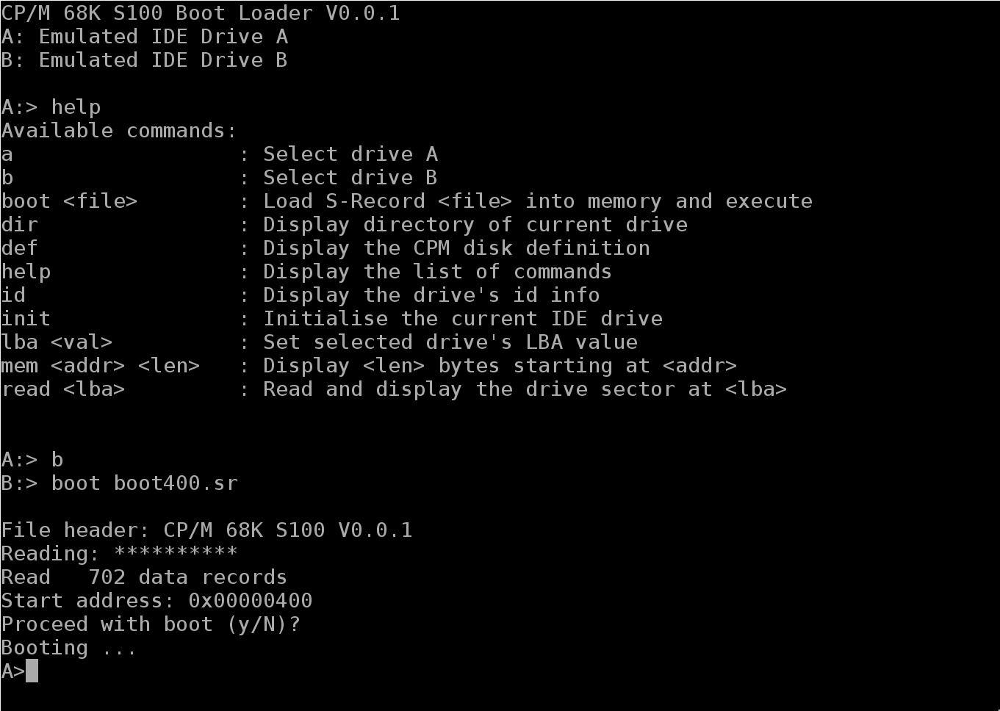

# CP/M 68K for the S100 68000/68010 Board

This project provides:
* Boot loader/monitor
* CP/M 68K BIOS
* CP/M file system images

This code assumes, and has been tested with, the following hardware:
* [68000/68010 Board](http://www.s100computers.com/My%20System%20Pages/68000%20Board/68K%20CPU%20Board.htm)
* [Propeller Console IO Board](http://www.s100computers.com/My%20System%20Pages/Console%20IO%20Board/Console%20IO%20Board.htm)
* [16MB Static RAM Board](http://www.s100computers.com/My%20System%20Pages/16MG%20RAM%20Board/16MG%20RAM%20Board.htm)
* [IDE/CF Board](http://www.s100computers.com/My%20System%20Pages/IDE%20Board/My%20IDE%20Card.htm)

# Release 0.1.0

Updates included in this release are:
* Bootable CP/M disk images
* Support for CF cards with MBR partition tables.
* Support for "virtual" disks on FAT16/32 file systems.

This release contains the following files:
* boot.srec - This is the boot loader / monitor in SRecord format and  must be burnt into the board's EPROMS,normal even/odd configuration.
* bios.srec - This is the bios in SRecord format.
* boot400.sr - This is the patched cpm400.sr and bios.srec concatenated into a single SRecord file
* diskAll.iso - Ten partition, bootable image in iso format using the 4mb-hd format, paritions 0 contains binary files from DISK1 - DISK9 of the CP/M 68K v1.3 binary distribution plus boot400.sr.  Partitions 1 contains the assembler source files for the puboot utility, boot loader BIOS and the CP/M BIOS plus submit files.
* drive_a.img - Single partition, bootable image using the 4mb-hd format and contains the binary files from DISK1 - DISK9 of the CP/M 68K V1.3 distribution.
* drive_b.img - Single partition image using the 4mb-hd format and containing the assembler source files for the puboot utility, boot loader BIOS and the CP/M BIOS plus submit files.
* drive_c.img - Single partition, empty image using the 4mb-hd format.

The drive_a.img, drive_b.img and drive_c.img images are intended to be used on a FAT16/32 CF card.

# Release 0.0.1

This release contains the following files:
* boot.srec - This is the boot loader / monitor in SRecord format and  must be burnt into the board's EPROMS,normal even/odd configuration.
* bios.srec - This is the bios in SRecord format.
* boot400.sr - This is the patched cpm400.sr and bios.srec concatenated into a single SRecord file
* disk1.img Single partition image using the 4mb-hd format containing boot400.sr and the contents of DISK1 of the CP/M 68K V1.3 binary distribution
* disk10.img Ten partition image using the 4mb-hd format, paritions 0 to 8 contain DISK1 - DISK9 of the CP/M 68K v1.3 binary distribution.  boot400.sr is in partition 0, partition 9 is empty.
* diskAll.img Ten partition image using the 4mb-hd format, paritions 0 contains all files from DISK1 - DISK9 of the CP/M 68K v1.3 binary distribution plus boot400.sr.  Partitions 1 - 9 are empty.

# Usage

1. Burn the boot.srec file into the boards EPROMS.  Copy one of the file system images to a CF card using your preferred tool, dd, balenaEtcher, etc.
1. Boot the 68000 into the boot loader/monitor.  Type `help<ENTER>` for a list of available commands.
1. Select the appropriate disk drive, a or b.
1. Type `boot boot400.sr<ENTER>` and the loader will start reading the file into memory.
1. When loading is complete, you will be prompted to continue, enter `y`.

You should now see the CP/M `A>` prompt.

# Building

Requires git, make, gnu 68000 cross tools, cpmtools to be installed.

Alternatively, use the following docker image which provides all the necessary tools:

  `docker run -it --rm --name 68k-tools -v {my project directory}:/opt/work dwildie/68k-tools:0.0.1 bash`
  
The [Dockerfile](https://github.com/dwildie/68k-tools/blob/master/docker/Dockerfile) documents the required tool installation.

Clone the repository: `git clone https://github.com/dwildie/cpm-68k.git`

To build:  In the top level directory, type `make`

## Boot loader/monitor
The Boot loader/monitor is build for the standard memory configuration:
+ 32KB RAM at 0xFD8000
+ 32KB ROM at 0xFD0000

For a different memory configuration modify the MEMORY section in the `boot.rom.lnk` file.

Once built, the target directory will contain `boot.srec` which should be burnt to the EPROMs, normal even/odd config.

## CP/M 68K BIOS
The BIOS is configured for a full populated 16MB static RAM board.  For a different memory configuration, modify the MEMORY section in the `bios.lnk` file.  The CP/M memory region table's entry is derived from the `bios.lnk` configuration so it must reflect the target hardware.

This BIOS delegates all console and disk IO to the boot loader/monitor.  Therefore, it will not function with another monitor.

The BIOS has a tuneable LRU disk buffer.  The tuning parameters are in `buffer.i`:
+ `BUFFER_COUNT` - The number of available buffers.  Buffers are reused based on a LRU algorithm.
+ `BUFFER_SECTORS` - The size of each buffer in HDD sectors (512 bytes).  The maximum size is 32 sectors, ie. 16KB per buffer.

The current configuration is:
+ `BUFFER_COUNT = 4`
+ `BUFFER_SECTORS = 8`

The BIOS is configured to support a maximum of 10 drives mapped to a single multi-partitioned disk image.  This can be increased by modifying the `DISK_COUNT` value in `bios.i` and allocating additional Disk Parameter Headers in `main.s`.

The BIOS is configured to work with the CPM400.SR system from DISK9 of the [CP/M 68K V1.3 distribution disks](http://cpm.z80.de/download/68kv1_3.zip).  The BIOS `_init` entry point has been moved from the original 0x6000 to 0x6200.  This shifts the BIOS out of the CPM400.SR BSS segment.  CPM400.SR is patched to suit.

Once built, the target directory will contain `bios.srec`.

## CP/M file system images
Each of the file system images contain the boot400.sr file in the first partition.  This file:
+ Contains the patched cpm400.sr and the bios.sr
+ Is the file that must be loaded and executed to start CP/M

Three file system image are built:
+ disk1.img Single partition image using the 4mb-hd format containing boot400.sr and the contents of DISK1 of the CP/M 68K V1.3 binary distribution
+ disk10.img Ten partition image using the 4mb-hd format, paritions 0 to 8 contain DISK1 - DISK9 of the CP/M 68K v1.3 binary distribution.  boot400.sr is in partition 0, partition 9 is empty.
+ diskAll.img Ten partition image using the 4mb-hd format, paritions 0 contains all files from DISK1 - DISK9 of the CP/M 68K v1.3 binary distribution plus boot400.sr.  Partitions 1 - 9 are empty.

# Contributions
The IDE code used in the boot loader/monitor was originally written by John Monahan who also designed the S-100 cards being used.  Thank you John.

The FAT16/32 library is from [Ultra-Embedded](http://ultra-embedded.com/fat_filelib/).
